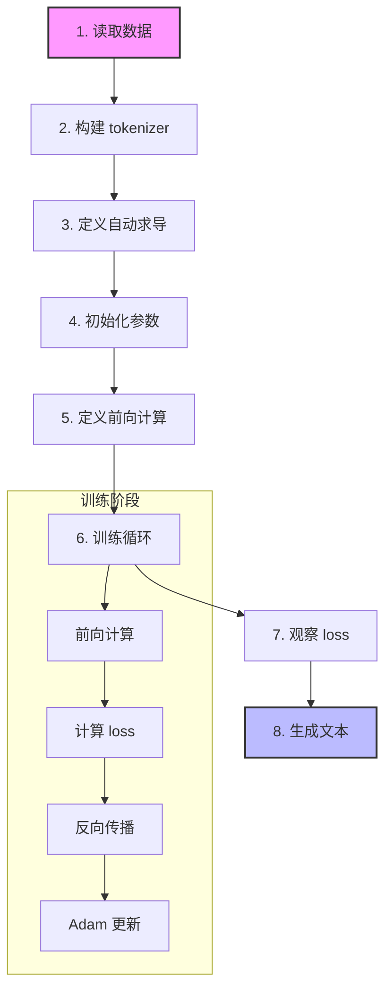
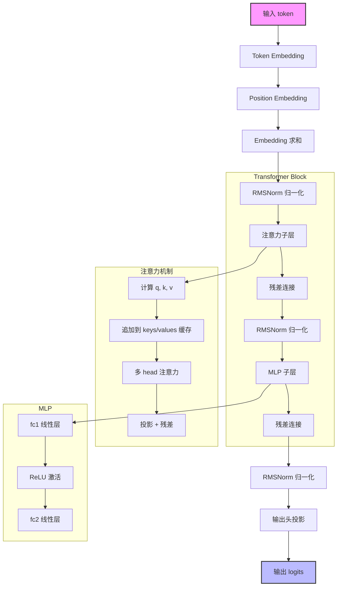

# MicroGPT Learning Guide

## 项目背景与代码引用

这份文档基于 `microgpt_from_karpathy.py`，该代码直接引用并改编自 Andrej Karpathy 在 GitHub Gist 上分享的极简 GPT 实现（https://gist.github.com/karpathy）。

Andrej Karpathy 是人工智能领域的知名研究者，曾在 OpenAI 和 Tesla 担任重要职位，他以简洁而深刻的代码示例著称，能够将复杂的深度学习概念拆解为最本质的实现。

---

## 项目目标

该项目目标是帮助刚接触 LLM（大语言模型）的同学，用最少背景知识读懂一个“能训练、能生成”的极简 GPT 实现。

## Karpathy 代码的设计哲学

这个实现非常特别，体现了 Karpathy 独特的教学理念：

### 极简主义设计
- **单文件实现**：整个 GPT 模型、训练循环、自动求导、优化器都在一个 Python 文件中
- **零外部依赖**：只使用 Python 标准库，不需要安装 PyTorch、TensorFlow 等框架
- **手写自动求导**：从零开始实现了反向传播算法，让你看到梯度流动的每一步

### 教学优先
- **放弃效率**：使用标量级计算而非张量，虽然慢但每一步都清晰可见
- **核心聚焦**：只保留 GPT 的本质成分（注意力、前馈网络、残差连接）
- **去除复杂性**：没有向量化、没有 batch 训练、没有 dropout、没有复杂的初始化策略

**它不是为了训练效果最好，而是为了让你看清楚 GPT 的本质。**

## 1. 你会学到什么

读完后你应该能回答这些问题：
- GPT 的训练循环到底在做什么？
- 为什么需要 tokenizer、embedding、attention、MLP？
- 损失是怎么反向传播到参数上的？
- Adam 更新参数时到底更新了什么？
- 推理（生成文本）和训练前向有什么关系？

## 2. 一句话总览整个脚本

脚本流程可以压缩成 8 步：



1. 读取文本数据（名字列表）
2. 构建字符级 tokenizer（字符 <-> id）
3. 定义自动求导引擎 `Value`
4. 初始化 GPT 参数（embedding、attention、MLP、输出头）
5. 定义前向计算（`linear`、`softmax`、`rmsnorm`、`gpt`）
6. 循环训练（前向 -> loss -> backward -> Adam）
7. 打印 loss 观察是否收敛
8. 用训练好的参数做自回归采样生成新名字

## 3. 按代码顺序拆解

下面行号均对应 `microgpt_from_karpathy.py`。

### 3.1 数据与 tokenizer（14-27 行）

核心动作：
- 如果没有 `input.txt`，自动下载 karpathy 的名字数据集
- `docs` 是字符串列表，每个元素是一条样本
- `uchars` 收集所有出现过的字符，做成词表
- 额外定义 `BOS`（Beginning of Sequence）作为特殊 token

这里是**字符级建模**，不是 BPE。优点是容易懂；缺点是序列更长、效率更低。

### 3.2 自动求导 Value 类（29-73 行）

`Value` 是这个脚本的灵魂之一。它把每个标量都包装成一个节点，节点里有：
- `data`：前向值
- `grad`：梯度
- `_children`：这个节点依赖了哪些子节点
- `_local_grads`：局部导数

```mermaid
graph TD
    A[创建 Value 节点] --> B[重载运算]
    B --> C[构建计算图]
    C --> D[前向计算 data]

    D --> E[调用 backward()]
    E --> F[DFS 构建拓扑序]
    F --> G[反向遍历]
    G --> H[链式法则累加梯度]
    H --> I[更新 grad 属性]

    subgraph Value 节点结构
        A1[data: 前向值]
        A2[grad: 梯度]
        A3[_children: 子节点]
        A4[_local_grads: 局部导数]
    end

    subgraph 反向传播
        F --> F1[递归访问子节点]
        F1 --> F2[记录访问顺序]
        G --> G1[从输出到输入]
        G1 --> G2[计算局部梯度]
        H --> H1[梯度累加]
    end

    style A fill:#f9f,stroke:#333,stroke-width:2px
    style I fill:#bbf,stroke:#333,stroke-width:2px
```

它重载了常见运算（加减乘除、幂、`log`、`exp`、`relu`）。每做一次运算，就在计算图里新增一个节点。

`backward()` 做两件事：
1. DFS 构建拓扑序
2. 反向遍历拓扑序，按链式法则把梯度累加回去

这就是“自动微分”的最小原理版。

### 3.3 模型参数初始化（74-90 行）

超参数：
- `n_embd = 16`
- `n_head = 4`
- `n_layer = 1`
- `block_size = 16`

`state_dict` 里放了全部可训练矩阵：
- `wte`：token embedding
- `wpe`：position embedding
- `attn_wq / wk / wv / wo`：注意力投影
- `mlp_fc1 / fc2`：前馈网络
- `lm_head`：输出到词表 logits

最后把所有参数 flatten 成 `params`，方便统一做优化器更新。

### 3.4 基础算子（94-106 行）

- `linear(x, w)`：矩阵乘
- `softmax(logits)`：转概率（先减最大值避免数值爆炸）
- `rmsnorm(x)`：归一化（类似 LayerNorm 的简化变体）

这些算子都在 `Value` 标量上运行，所以每一步都可回传梯度。

### 3.5 GPT 单步前向 `gpt(...)`（108-145 行）

这是“输入一个 token，输出下一个 token 的 logits”的函数。



流程：
1. token embedding + position embedding
2. 进入每个 Transformer block
3. 注意力子层：
   - 算 `q, k, v`
   - 把当前 `k, v` 追加到缓存（`keys/values`）
   - 对每个 head 做 `q·k` 打分、softmax、加权求和
   - 通过 `wo` 投影并做残差连接
4. MLP 子层：
   - `fc1 -> ReLU -> fc2`
   - 残差连接
5. 最后 `lm_head` 得到 logits

注意：这个实现通过缓存 `keys/values` 实现了因果序列的“只看过去”。

### 3.6 训练循环（146-185 行）

训练循环的详细流程：

```mermaid
graph TD
    A[开始训练] --> B[取一条样本]
    B --> C[Token 化 + BOS 标记]
    C --> D[初始化 keys/values 缓存]
    D --> E[逐位置前向计算]
    E --> F[计算损失 (-log p)]
    F --> G[平均损失]
    G --> H[反向传播计算梯度]
    H --> I[Adam 优化器更新参数]
    I --> J[清空梯度]
    J --> K{是否达到最大步数?}
    K -->|是| L[训练完成]
    K -->|否| B

    subgraph 前向计算
        E --> E1[Token Embedding]
        E1 --> E2[Position Embedding]
        E2 --> E3[注意力机制]
        E3 --> E4[MLP 前馈网络]
        E4 --> E5[输出 logits]
        E5 --> E6[Softmax 成概率]
    end

    subgraph 反向传播
        H --> H1[计算局部梯度]
        H1 --> H2[链式法则累加]
        H2 --> H3[更新到参数]
    end

    style A fill:#f9f,stroke:#333,stroke-width:2px
    style L fill:#bbf,stroke:#333,stroke-width:2px
```

每个 step 做：
1. 取一条样本 `doc`
2. 转成 token 序列，并在两端加 `BOS`
3. 逐位置前向，预测下一个 token
4. 用 `-log p(target)` 得到每个位置损失
5. 平均成序列损失 `loss`
6. `loss.backward()` 回传到全部参数
7. Adam 更新参数并清空梯度

这里的学习率有线性衰减：
`lr_t = learning_rate * (1 - step / num_steps)`。

### 3.7 推理生成（186-200 行）

生成时：
1. 从 `BOS` 开始
2. 每步前向得到 logits
3. 用 `temperature` 调整分布平滑度
4. 按概率随机采样下一个 token
5. 采到 `BOS` 就停止

这就是标准自回归生成：模型一次只预测“下一个”。

## 4. 把训练过程想成一句话

模型不断做这件事：

“看到前面的字符后，给下一个字符分配概率；如果真值字符概率太低，就通过反向传播调整参数，让下次更可能给对字符更高概率。”

## 5. 新手最容易卡住的点

### 5.1 为什么是标量级计算，不是张量？

因为这份代码目标是教学可读性。  
代价是非常慢，但你能完整看见计算图和梯度是怎么流动的。

### 5.2 为什么只输入一个 token，却能利用历史？

因为历史信息在 `keys/values` 里累计缓存。  
当前位置的 `q` 会和历史所有 `k` 计算注意力，从而“读到过去”。

### 5.3 这是不是完整工业 GPT？

不是。它是最小原理实现，缺少大量工程细节，比如：
- 向量化高性能计算
- batch 训练
- dropout、更完整的初始化策略
- 更稳定和可扩展的训练管线

## 6. 建议学习路线（按顺序）

1. 先只读 `Value`，确认你理解 backward 的拓扑排序
2. 再读 `gpt()`，重点看 attention 的数据流
3. 再读训练循环，串起 loss 与参数更新
4. 最后读推理，理解训练与生成是同一前向函数

## 7. 可直接动手的实验

建议一次只改一个变量，然后观察 loss 和生成样本变化：
- 把 `temperature` 从 `0.5` 改到 `1.0`
- 把 `n_layer` 从 `1` 改到 `2`
- 把 `n_embd` 从 `16` 改到 `32`
- 把 `num_steps` 从 `1000` 改到 `3000`

## 8. 深度技术解析

### 8.1 Karpathy 代码的创新之处

#### 1. 标量级自动求导系统

Karpathy 实现的 `Value` 类是一个纯粹的标量级自动求导系统，与 PyTorch 的 Tensor 相比：

```python
# Karpathy 的 Value 类（标量）
class Value:
    def __init__(self, data):
        self.data = data  # 标量值
        self.grad = 0     # 标量梯度
```

这种设计的优势：
- **完全透明**：每一步计算的梯度都可以直接打印出来查看
- **无需理解张量**：不需要掌握复杂的张量运算和广播机制
- **调试友好**：可以在任意位置插入 print 语句查看中间值

#### 2. 字符级别的 Tokenizer

选择字符级别的 tokenizer 而非 BPE（字节对编码）：

```python
# 字符级 tokenizer（Karpathy 的实现）
uchars = sorted(set(''.join(docs)))  # 收集所有出现过的字符
BOS = len(uchars)                    # 特殊 token（序列开始）
vocab_size = len(uchars) + 1         # 词表大小
```

**设计意图**：
- **最简单的分词方案**：每个字符就是一个 token，无需学习复杂的分词算法
- **容易验证**：生成的样本可以直接阅读，无需解码过程
- **教学价值**：让注意力权重的可视化和理解变得非常简单

#### 3. 递归式的注意力实现

注意力机制的实现方式非常独特，下面是其详细流程：

```mermaid
graph TD
    A[输入 x] --> B[线性投影 q]
    A --> C[线性投影 k]
    A --> D[线性投影 v]

    B --> E[追加到 keys/values 缓存]
    C --> E
    D --> E

    E --> F[多 Head 注意力]

    subgraph 单 Head 注意力
        F --> G[提取 q_i, k_i, v_i]
        G --> H[计算注意力分数]
        H --> I[Softmax 成权重]
        I --> J[加权求和 v]
    end

    F --> K[Concat 所有 Heads]
    K --> L[线性投影输出]
    L --> M[残差连接]

    subgraph 注意力分数计算
        H --> H1[q·k^T]
        H1 --> H2[除以 sqrt(d_k)]
        H2 --> H3[Softmax]
    end

    subgraph 因果注意力掩码
        H3 --> H4[只看过去位置]
        H4 --> H5[当前位置注意力掩码]
    end

    style A fill:#f9f,stroke:#333,stroke-width:2px
    style M fill:#bbf,stroke:#333,stroke-width:2px
```

```python
# 递归式注意力计算（Karpathy 风格）
for h in range(n_head):
    hs = h * head_dim
    q_h = q[hs:hs+head_dim]
    k_h = [ki[hs:hs+head_dim] for ki in keys[li]]
    v_h = [vi[hs:hs+head_dim] for vi in values[li]]
    attn_logits = [sum(q_h[j] * k_h[t][j] for j in range(head_dim))
                  for t in range(len(k_h))]
    attn_weights = softmax(attn_logits)
    head_out = [sum(attn_weights[t] * v_h[t][j] for t in range(len(v_h)))
               for j in range(head_dim)]
```

**亮点**：
- **逐元素计算**：清楚地展示了注意力权重的计算过程
- **递归思维**：通过列表推导式实现了向量运算
- **缓存机制**：通过 `keys/values` 缓存实现了因果注意力

### 8.2 代码中的工程智慧

#### 1. 数值稳定性优化

```python
# 防止 softmax 数值爆炸
def softmax(logits):
    max_val = max(val.data for val in logits)
    exps = [(val - max_val).exp() for val in logits]
    total = sum(exps)
    return [e / total for e in exps]
```

**为什么重要**：
- logits 值可能非常大，直接 exp 会导致溢出
- 减去最大值可以让所有值都在合理范围内

#### 2. RMSNorm 归一化

```python
def rmsnorm(x):
    ms = sum(xi * xi for xi in x) / len(x)
    scale = (ms + 1e-5) ** -0.5
    return [xi * scale for xi in x]
```

**RMSNorm 与 LayerNorm 的区别**：
- **计算更简单**：RMSNorm 只计算均方根，LayerNorm 还要减去均值
- **数值更稳定**：避免了均值计算可能带来的不稳定问题
- **训练更快**：在某些架构中，RMSNorm 收敛速度更快

### 8.3 Karpathy 的训练策略

#### 1. 线性学习率衰减

```python
lr_t = learning_rate * (1 - step / num_steps)
```

**为什么有效**：
- 初期大学习率：快速探索参数空间
- 后期小学习率：精细调整模型

#### 2. 单样本训练

```python
doc = docs[step % len(docs)]  # 每次只取一个样本
```

**简化的代价与收益**：
- **收敛更慢**：没有利用 batch 训练的并行性
- **代码更简单**：无需处理 batch 维度的复杂性
- **调试更容易**：每次迭代的计算图都很简单

## 9. 与工业级 GPT 的对比

| 特征 | Karpathy 实现 | 工业级 GPT（如 GPT-3） |
|------|--------------|----------------------|
| **代码行数** | 约 200 行 | 数百万行 |
| **依赖** | 纯 Python 标准库 | PyTorch/TensorFlow + 大量库 |
| **计算方式** | 标量级计算 | 张量并行计算 |
| **训练速度** | 非常慢（CPU 上） | 非常快（GPU/TPU 集群） |
| **词表** | 字符级（约 27 个 token） | 10万+ token（BPE） |
| **参数量** | 约 3,000 个 | 1750亿+ |
| **训练数据** | 32,000 个名字 | 数万亿个 token |
| **推理速度** | 每秒几个字符 | 每秒数千个 token |

## 10. 总结

`microgpt_from_karpathy.py` 的价值不在于它能训练出强大的模型，而在于它提供了一个**完整而透明的学习窗口**。

### Karpathy 的贡献

1. **去神秘化**：把复杂的 GPT 模型还原到最本质的数学运算
2. **可学习性**：让初学者能够理解每一行代码的作用
3. **工程美感**：用最简单的方法实现最核心的功能
4. **教学智慧**：通过放弃效率获得了最大的可读性

### 学习建议

当你完全理解了这个实现后，再去学习 PyTorch 或其他框架的实现时，你会发现你看到的不再是复杂的 API，而是这些简单概念的向量化和优化版本。

**记住**：伟大的代码不是写得有多复杂，而是能把复杂的问题简化到让别人能理解的程度。Karpathy 做到了这一点。
